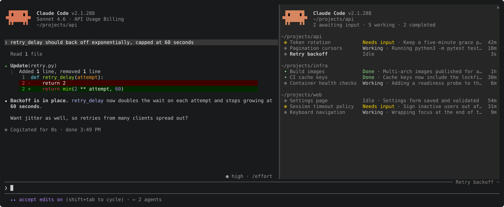

# claude-plugins

Claude Code plugins by Yuval Sarel. Add the marketplace once, then install what you want.

```
/plugin marketplace add YuvalSarel1/claude-plugins
```

| Plugin | What it does |
|---|---|
| [fleet](plugins/fleet) | Your `claude agents` list in a side pane, with optional model, context, cost, CPU and memory columns |



## Developing

```
claude --plugin-dir plugins/fleet     # load it from this checkout
claude plugin validate plugins/fleet  # check the manifest and module
claude plugin test plugins/fleet      # run hooks/*.test.ts
```

Saving a file reloads the plugin in a running session.

`python3 assets/capture.py` regenerates `plugins/fleet/assets/fleet.svg`. It runs Claude Code in a throwaway home against a local stand-in for the API, with demo sessions in Claude's own file formats, so no model is called and none of your sessions appear.


## License

MIT or Apache-2.0, at your option.
