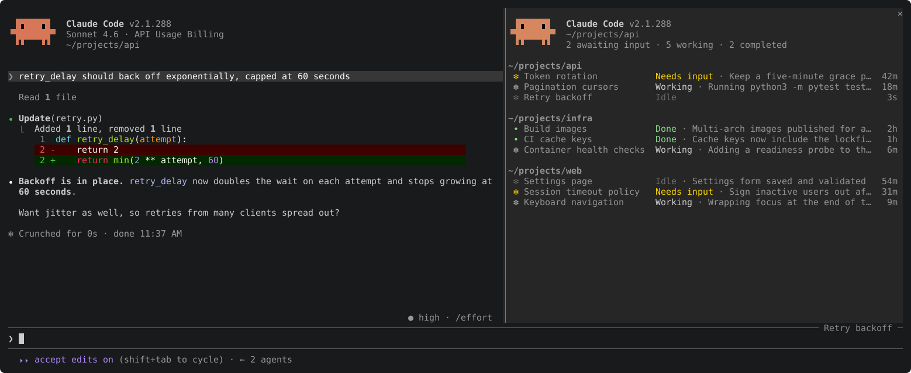

# claude-plugins

Claude Code plugins by Yuval Sarel. Add the marketplace once, then install what you want.

```
/plugin marketplace add YuvalSarel1/claude-plugins
```

| Plugin | What it does |
|---|---|
| [fleet](#fleet) | Your `claude agents` list in a side pane |

## fleet

`claude agents` shows every session on the machine, but only in its own screen. fleet keeps that list beside the conversation you are in, so you see which sessions need you without leaving it.

```
/plugin install fleet@yuvalsarel1
```



The list comes from `claude agents --json --all`. States, lines and ages follow the agents view, and working rows animate with Claude's own spinner.

### Using it

| Action | How |
|---|---|
| Turn the pane on or off | `/fleet`. The choice holds across sessions. |
| Where it shows | Docked beside the transcript in fullscreen from 110 columns; above the prompt otherwise. It opens by itself from 144 columns. |
| Refresh | Every 3 seconds the pane checks the session files Claude Code writes, and reruns `claude agents` only when one changed, or every 30 seconds. Nothing runs while the pane is closed or hidden. |

### Settings

Each setting is a row in `/config`. Extra columns are off, so the default row reads like `claude agents`.

| Setting | Default | Shows |
|---|---|---|
| Spinner | on | Working rows animate as in Claude Code. Off saves about 2% of a core with four sessions working. |
| Status width | 20 | Columns kept for the status text. Long names shrink first. |
| Model | off | `opus[1m]` |
| Effort | off | `medium` |
| Tokens | off | `32.9k` |
| Tasks | off | Background tasks running |
| Kind | off | `bg` or interactive |
| Prompt | off | The session's first request |
| Context | off | `174k/1.0M` |
| Cost | off | `$4.38` |
| CPU | off | `3%` |
| Memory | off | `650M` |

Model, effort, tokens, tasks and prompt come from each background job's `~/.claude/jobs/<id>/state.json`. CPU and memory come from `ps`.

Context and cost are what Claude Code reports to your statusLine, so they need your statusLine command to save that report. With the command's stdin read into `$input`, add:

```sh
mkdir -p ~/.claude/statusline
printf '%s' "$input" > ~/.claude/statusline/"$(jq -r .session_id <<<"$input")".json
```

This is the same file [cones](https://github.com/YuvalSarel1/cones) reads. Without it those two columns show `-`.

### Limits

| Limit | Why |
|---|---|
| The pane is always on the right | Claude Code places plugin panes; a plugin cannot pick the side. |
| Rows are not clickable | Open sessions from `claude agents` itself. |
| Finished sessions' ages and folder order can differ from the agents view | Its exact rules are not published. |
| Can break on a Claude Code update | The plugin API is early access, and `state.json` is not a documented format. |

### Developing

```
claude --plugin-dir plugins/fleet     # load it from this checkout
claude plugin validate plugins/fleet  # check the manifest and module
claude plugin test plugins/fleet      # run hooks/*.test.ts
```

Saving a file reloads the plugin in a running session.

`python3 assets/capture.py` regenerates `assets/fleet.svg`. It runs Claude Code in a throwaway home against a local stand-in for the API, with demo sessions in Claude's own file formats, so no model is called and none of your sessions appear.

## License

MIT or Apache-2.0, at your option.
